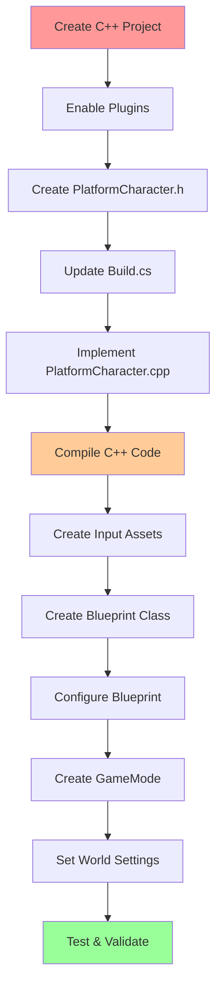

# Milestone 1 - Detailed Implementation

**Goal:** Create controllable character with camera, input, and movement (double jump, sprint)

**Estimated Time:** 6-8 hours over 2-3 sessions

## Overview Checklist

- [ ] Create C++ project with proper plugins
- [ ] Implement APlatformCharacter class
- [ ] Set up Enhanced Input system
- [ ] Configure camera and movement
- [ ] Test all functionality in PIE

---

## Session 1: Project Setup & Character Foundation (2-3 hours)

### Step 1.1: Project Creation (15 minutes)

**Create the UE Project:**

1. Open Epic Games Launcher → Unreal Engine → Launch 5.6+
2. New Project → Games → Third Person → C++ (not Blueprint)
3. Project Name: `Platformer`
4. Location: Choose your companion repo folder
5. Click "Create"

**Verify Setup:**

- [ ] Project opens without errors
- [ ] Can compile (Build → Build Solution in VS)
- [ ] PIE works with default character

**If Issues:** See [Troubleshooting Guide](/guide/troubleshooting#compilation-errors)

### Step 1.2: Enable Required Plugins (10 minutes)

**In UE Editor:**

1. Edit → Plugins
2. Search and Enable these plugins:
   - ✅ Enhanced Input (should be enabled by default in UE5.6+)
   - ✅ AI Module
   - ✅ UMG
   - ✅ Navigation System
3. Restart Editor when prompted

**Verify:**

- [ ] All plugins show as "Enabled"
- [ ] No plugin errors in Output Log

### Step 1.3: Create Platform Character Class (45 minutes)

**Create Header File:**

1. In UE: Tools → New C++ Class → Character → Next
2. Name: `PlatformCharacter`
3. Click "Create Class"
4. Wait for VS to open with the new files

**Replace the generated header content:**

`Source/Platformer/PlatformCharacter.h`:

```cpp
#pragma once

#include "CoreMinimal.h"
#include "GameFramework/Character.h"
#include "InputActionValue.h"
#include "PlatformCharacter.generated.h"

class USpringArmComponent;
class UCameraComponent;
class UInputMappingContext;
class UInputAction;

UCLASS()
class PLATFORMER_API APlatformCharacter : public ACharacter
{
	GENERATED_BODY()

public:
	APlatformCharacter();

protected:
	// Called when the game starts or when spawned
	virtual void BeginPlay() override;

	// Called to bind functionality to input
	virtual void SetupPlayerInputComponent(class UInputComponent* PlayerInputComponent) override;

	// Input Actions
	UPROPERTY(EditAnywhere, BlueprintReadOnly, Category = Input, meta = (AllowPrivateAccess = "true"))
	UInputMappingContext* DefaultMappingContext;

	UPROPERTY(EditAnywhere, BlueprintReadOnly, Category = Input, meta = (AllowPrivateAccess = "true"))
	UInputAction* JumpAction;

	UPROPERTY(EditAnywhere, BlueprintReadOnly, Category = Input, meta = (AllowPrivateAccess = "true"))
	UInputAction* MoveAction;

	UPROPERTY(EditAnywhere, BlueprintReadOnly, Category = Input, meta = (AllowPrivateAccess = "true"))
	UInputAction* LookAction;

	UPROPERTY(EditAnywhere, BlueprintReadOnly, Category = Input, meta = (AllowPrivateAccess = "true"))
	UInputAction* SprintAction;

	// Input Functions
	void Move(const FInputActionValue& Value);
	void Look(const FInputActionValue& Value);
	void StartSprint();
	void StopSprint();

private:
	// Camera boom positioning the camera behind the character
	UPROPERTY(VisibleAnywhere, BlueprintReadOnly, Category = Camera, meta = (AllowPrivateAccess = "true"))
	USpringArmComponent* CameraBoom;

	// Follow camera
	UPROPERTY(VisibleAnywhere, BlueprintReadOnly, Category = Camera, meta = (AllowPrivateAccess = "true"))
	UCameraComponent* FollowCamera;

	// Movement speeds
	UPROPERTY(EditAnywhere, BlueprintReadOnly, Category = Movement, meta = (AllowPrivateAccess = "true"))
	float WalkSpeed = 600.0f;

	UPROPERTY(EditAnywhere, BlueprintReadOnly, Category = Movement, meta = (AllowPrivateAccess = "true"))
	float SprintSpeed = 900.0f;

	bool bIsSprinting = false;

public:
	// Getter for camera boom
	FORCEINLINE USpringArmComponent* GetCameraBoom() const { return CameraBoom; }
	// Getter for follow camera
	FORCEINLINE UCameraComponent* GetFollowCamera() const { return FollowCamera; }
};
```

**Update Build Dependencies:**

Edit `Source/Platformer/Platformer.Build.cs`:

```csharp
using UnrealBuildTool;

public class Platformer : ModuleRules
{
	public Platformer(ReadOnlyTargetRules Target) : base(Target)
	{
		PCHUsage = PCHUsageMode.UseExplicitOrSharedPCHs;

		PublicDependencyModuleNames.AddRange(new string[] {
			"Core",
			"CoreUObject",
			"Engine",
			"InputCore",
			"EnhancedInput",
			"AIModule",
			"UMG",
			"GameplayTasks",
			"NavigationSystem"
		});

		PrivateDependencyModuleNames.AddRange(new string[] {  });
	}
}
```

**Compile and Test:**

1. Build → Build Solution in Visual Studio
2. Should compile successfully
3. Don't run yet - we need to implement the .cpp file

### Step 1.4: Implement Character Logic (60 minutes)

**Replace the generated .cpp content:**

`Source/Platformer/PlatformCharacter.cpp`:

```cpp
#include "PlatformCharacter.h"
#include "Camera/CameraComponent.h"
#include "Components/CapsuleComponent.h"
#include "Components/InputComponent.h"
#include "GameFramework/CharacterMovementComponent.h"
#include "GameFramework/Controller.h"
#include "GameFramework/SpringArmComponent.h"
#include "EnhancedInputComponent.h"
#include "EnhancedInputSubsystems.h"

APlatformCharacter::APlatformCharacter()
{
	// Set size for collision capsule
	GetCapsuleComponent()->InitCapsuleSize(42.f, 96.0f);

	// Don't rotate when the controller rotates - for platformer camera
	bUseControllerRotationPitch = false;
	bUseControllerRotationYaw = false;
	bUseControllerRotationRoll = false;

	// Configure character movement
	GetCharacterMovement()->bOrientRotationToMovement = true; // Character moves in the direction of input
	GetCharacterMovement()->RotationRate = FRotator(0.0f, 500.0f, 0.0f); // at this rotation rate

	// Configure movement settings
	GetCharacterMovement()->JumpZVelocity = 700.f;
	GetCharacterMovement()->AirControl = 0.35f;
	GetCharacterMovement()->MaxWalkSpeed = WalkSpeed;
	GetCharacterMovement()->MinAnalogWalkSpeed = 20.f;
	GetCharacterMovement()->BrakingDecelerationWalking = 2000.f;

	// Configure double jump
	GetCharacterMovement()->JumpMaxCount = 2;

	// Create a camera boom (pulls in towards the player if there is a collision)
	CameraBoom = CreateDefaultSubobject<USpringArmComponent>(TEXT("CameraBoom"));
	CameraBoom->SetupAttachment(RootComponent);
	CameraBoom->TargetArmLength = 450.0f; // The camera follows at this distance behind the character
	CameraBoom->bUsePawnControlRotation = false; // Don't rotate the arm based on the controller
	CameraBoom->SetRelativeRotation(FRotator(-15.0f, 0.0f, 0.0f)); // Slight downward angle

	// Create a follow camera
	FollowCamera = CreateDefaultSubobject<UCameraComponent>(TEXT("FollowCamera"));
	FollowCamera->SetupAttachment(CameraBoom, USpringArmComponent::SocketName);
	FollowCamera->bUsePawnControlRotation = false; // Camera does not rotate relative to arm
}

void APlatformCharacter::BeginPlay()
{
	Super::BeginPlay();

	// Validate all required assets before proceeding
	if (!ensure(DefaultMappingContext))
	{
		UE_LOG(LogTemp, Error, TEXT("DefaultMappingContext not set on %s"), *GetName());
		return;
	}

	if (!ensure(JumpAction))
	{
		UE_LOG(LogTemp, Error, TEXT("JumpAction not set on %s"), *GetName());
	}

	if (!ensure(MoveAction))
	{
		UE_LOG(LogTemp, Error, TEXT("MoveAction not set on %s"), *GetName());
	}

	if (!ensure(LookAction))
	{
		UE_LOG(LogTemp, Error, TEXT("LookAction not set on %s"), *GetName());
	}

	if (!ensure(SprintAction))
	{
		UE_LOG(LogTemp, Error, TEXT("SprintAction not set on %s"), *GetName());
	}

	// Add Input Mapping Context with proper validation
	if (APlayerController* PlayerController = Cast<APlayerController>(Controller))
	{
		if (UEnhancedInputLocalPlayerSubsystem* Subsystem = ULocalPlayer::GetSubsystem<UEnhancedInputLocalPlayerSubsystem>(PlayerController->GetLocalPlayer()))
		{
			Subsystem->AddMappingContext(DefaultMappingContext, 0);
			UE_LOG(LogTemp, Log, TEXT("Successfully added Input Mapping Context for %s"), *GetName());
		}
		else
		{
			UE_LOG(LogTemp, Warning, TEXT("Failed to get Enhanced Input Subsystem for %s"), *GetName());
		}
	}
	else
	{
		UE_LOG(LogTemp, Warning, TEXT("No PlayerController found for %s, input will not work"), *GetName());
	}

	// Validate camera components
	if (!ensure(CameraBoom))
	{
		UE_LOG(LogTemp, Error, TEXT("CameraBoom component not created on %s"), *GetName());
	}

	if (!ensure(FollowCamera))
	{
		UE_LOG(LogTemp, Error, TEXT("FollowCamera component not created on %s"), *GetName());
	}

	// Log successful initialization
	UE_LOG(LogTemp, Log, TEXT("PlatformCharacter %s initialized successfully"), *GetName());
}

void APlatformCharacter::SetupPlayerInputComponent(UInputComponent* PlayerInputComponent)
{
	Super::SetupPlayerInputComponent(PlayerInputComponent);

	// Set up action bindings
	if (UEnhancedInputComponent* EnhancedInputComponent = CastChecked<UEnhancedInputComponent>(PlayerInputComponent))
	{
		// Jumping
		EnhancedInputComponent->BindAction(JumpAction, ETriggerEvent::Triggered, this, &ACharacter::Jump);
		EnhancedInputComponent->BindAction(JumpAction, ETriggerEvent::Completed, this, &ACharacter::StopJumping);

		// Moving
		EnhancedInputComponent->BindAction(MoveAction, ETriggerEvent::Triggered, this, &APlatformCharacter::Move);

		// Looking
		EnhancedInputComponent->BindAction(LookAction, ETriggerEvent::Triggered, this, &APlatformCharacter::Look);

		// Sprinting
		EnhancedInputComponent->BindAction(SprintAction, ETriggerEvent::Started, this, &APlatformCharacter::StartSprint);
		EnhancedInputComponent->BindAction(SprintAction, ETriggerEvent::Completed, this, &APlatformCharacter::StopSprint);
	}
}

void APlatformCharacter::Move(const FInputActionValue& Value)
{
	// Validate that we have a controller
	if (!ensure(Controller))
	{
		UE_LOG(LogTemp, Warning, TEXT("No Controller available for movement on %s"), *GetName());
		return;
	}

	// Input is a Vector2D
	FVector2D MovementVector = Value.Get<FVector2D>();

	// Early return if no input
	if (MovementVector.IsNearlyZero())
	{
		return;
	}

	// Find out which way is forward
	const FRotator Rotation = Controller->GetControlRotation();
	const FRotator YawRotation(0, Rotation.Yaw, 0);

	// Get forward direction
	const FVector ForwardDirection = FRotationMatrix(YawRotation).GetUnitAxis(EAxis::X);

	// Get right direction
	const FVector RightDirection = FRotationMatrix(YawRotation).GetUnitAxis(EAxis::Y);

	// Add movement
	AddMovementInput(ForwardDirection, MovementVector.Y);
	AddMovementInput(RightDirection, MovementVector.X);
}

void APlatformCharacter::Look(const FInputActionValue& Value)
{
	// Validate that we have a controller
	if (!ensure(Controller))
	{
		UE_LOG(LogTemp, Warning, TEXT("No Controller available for look input on %s"), *GetName());
		return;
	}

	// Input is a Vector2D
	FVector2D LookAxisVector = Value.Get<FVector2D>();

	// Early return if no input
	if (LookAxisVector.IsNearlyZero())
	{
		return;
	}

	// Add yaw and pitch input to controller
	AddControllerYawInput(LookAxisVector.X);
	AddControllerPitchInput(LookAxisVector.Y);
}

void APlatformCharacter::StartSprint()
{
	// Validate movement component exists
	if (!ensure(GetCharacterMovement()))
	{
		UE_LOG(LogTemp, Error, TEXT("No CharacterMovement component on %s"), *GetName());
		return;
	}

	bIsSprinting = true;
	GetCharacterMovement()->MaxWalkSpeed = SprintSpeed;
	UE_LOG(LogTemp, Log, TEXT("Sprint started on %s"), *GetName());
}

void APlatformCharacter::StopSprint()
{
	// Validate movement component exists
	if (!ensure(GetCharacterMovement()))
	{
		UE_LOG(LogTemp, Error, TEXT("No CharacterMovement component on %s"), *GetName());
		return;
	}

	bIsSprinting = false;
	GetCharacterMovement()->MaxWalkSpeed = WalkSpeed;
	UE_LOG(LogTemp, Log, TEXT("Sprint stopped on %s"), *GetName());
}
```

**Compile and Test:**

1. Build → Build Solution
2. Should compile successfully
3. If errors, check [Troubleshooting Guide](/guide/troubleshooting)

---

## Session 2: Enhanced Input Setup (1-2 hours)

### Step 2.1: Create Input Action Assets (30 minutes)

**In UE Content Browser:**

1. **Create Input Actions:**
   - Right-click in Content → Input → Input Action
   - Create these 4 Input Actions:
     - `IA_Jump` (Value Type: Digital Bool)
     - `IA_Move` (Value Type: Axis2D Vector2D)
     - `IA_Look` (Value Type: Axis2D Vector2D)
     - `IA_Sprint` (Value Type: Digital Bool)

2. **Create Input Mapping Context:**
   - Right-click in Content → Input → Input Mapping Context
   - Name: `IMC_Player`

3. **Configure the Mapping Context:**
   - Double-click `IMC_Player` to open
   - Add mappings:

   **IA_Jump:**
   - Key: Space Bar
   - Key: Gamepad Face Button Bottom (A/X)

   **IA_Move:**
   - Key: W (Modifiers: Swizzle Input Axis Values → YXZ)
   - Key: S (Modifiers: Negate → Y, Swizzle → YXZ)
   - Key: A (Modifiers: Negate → X)
   - Key: D (no modifiers)
   - Key: Gamepad Left Thumbstick 2D-Axis

   **IA_Look:**
   - Key: Mouse XY 2D-Axis
   - Key: Gamepad Right Thumbstick 2D-Axis

   **IA_Sprint:**
   - Key: Left Shift
   - Key: Gamepad Left Shoulder

### Step 2.2: Connect Input Assets to Character (15 minutes)

**In UE Editor:**

1. Compile C++ project (if not already done)
2. In Content Browser → C++ Classes → Platformer → PlatformCharacter
3. Create Blueprint: Right-click → Create Blueprint class based on PlatformCharacter
4. Name: `BP_PlatformCharacter`

**Configure Blueprint:**

1. Open `BP_PlatformCharacter`
2. In Details panel, find Input section:
   - Default Mapping Context: Set to `IMC_Player`
   - Jump Action: Set to `IA_Jump`
   - Move Action: Set to `IA_Move`
   - Look Action: Set to `IA_Look`
   - Sprint Action: Set to `IA_Sprint`
3. Compile and Save

### Step 2.3: Set as Default Pawn (10 minutes)

**Update Game Mode:**

1. Create Blueprint GameMode: Content Browser → Blueprint Class → Game Mode Base
2. Name: `BP_PlatformerGameMode`
3. Open it, set Default Pawn Class: `BP_PlatformCharacter`
4. Save

**Set in World Settings:**

1. In level editor: Settings → World Settings
2. Game Mode Override: `BP_PlatformerGameMode`

### Step 2.4: Test Everything (15 minutes)

**Verification Checklist:**

- [ ] Play in Editor (PIE)
- [ ] WASD moves character in world space (not relative to camera)
- [ ] Mouse look rotates camera around character
- [ ] Space bar jumps (double jump works)
- [ ] Left Shift sprints (character moves faster)
- [ ] Camera follows character smoothly
- [ ] No compilation errors
- [ ] No runtime errors in Output Log

### Step 2.5: Implementation Validation & Troubleshooting (15 minutes)

**Complete Implementation Dependencies:**

Before testing, ensure this order was followed:

1. ✅ Header file created with all UPROPERTY declarations
2. ✅ Build.cs file updated with required modules
3. ✅ .cpp file implemented with validation
4. ✅ Input Action assets created in Content Browser
5. ✅ Input Mapping Context created and configured
6. ✅ Blueprint derived from C++ class
7. ✅ Blueprint configured with Input Asset references
8. ✅ Game Mode created and set as default
9. ✅ World Settings updated to use custom Game Mode

**Common Issues & Solutions:**

| Problem                | Likely Cause                       | Solution                                  |
| ---------------------- | ---------------------------------- | ----------------------------------------- |
| Character doesn't move | Input Actions not set in Blueprint | Check BP_PlatformCharacter Details panel  |
| Compilation errors     | Missing module in Build.cs         | Verify EnhancedInput module added         |
| Input not responding   | IMC not added to controller        | Check BeginPlay() validation logs         |
| Sprint not working     | Movement component null            | Verify CharacterMovement component exists |
| Camera not following   | SpringArm/Camera setup error       | Check component creation in constructor   |

**Validation Log Messages:**

When working correctly, you should see these messages in Output Log:

```
LogTemp: Successfully added Input Mapping Context for BP_PlatformCharacter_C_0
LogTemp: PlatformCharacter BP_PlatformCharacter_C_0 initialized successfully
LogTemp: Sprint started on BP_PlatformCharacter_C_0
LogTemp: Sprint stopped on BP_PlatformCharacter_C_0
```

**If You See Error Messages:**

```
LogTemp: Error: DefaultMappingContext not set on BP_PlatformCharacter_C_0
```

→ Solution: Set DefaultMappingContext in Blueprint Details panel

```
LogTemp: Warning: No Controller available for movement
```

→ Solution: Ensure character is possessed by PlayerController in Game Mode

**Performance Validation:**

- [ ] Frame rate stable (check Stats → FPS in PIE)
- [ ] No excessive log spam
- [ ] Smooth character movement with no hitches

**Expected Behavior:**

- Character should move smoothly with WASD
- Camera should orbit around character with mouse
- Double jump should work from any state
- Sprint should increase movement speed noticeably
- Camera should have slight downward angle

---

## Session 3: Camera Tuning & Polish (1-2 hours)

### Step 3.1: Camera Fine-tuning (30 minutes)

**Adjust Camera Settings in BP_PlatformCharacter:**

1. Select CameraBoom component
2. In Details → Camera Settings:
   - Target Arm Length: 450 (adjust between 350-600 to taste)
   - Socket Offset: Z = 50 (raises camera slightly)
   - Do Collision Test: ✅ (prevents camera clipping)

3. In Details → Lag:
   - Enable Camera Lag: ✅
   - Camera Lag Speed: 12.0
   - Enable Camera Rotation Lag: ✅
   - Camera Rotation Lag Speed: 10.0

4. Test and adjust until camera feels responsive but smooth

### Step 3.2: Movement Tuning (30 minutes)

**In BP_PlatformCharacter → Character Movement:**

- Max Walk Speed: 600
- Max Acceleration: 2048
- Braking Deceleration Walking: 2000
- Ground Friction: 8.0
- Air Control: 0.35
- Jump Z Velocity: 700
- Jump Max Count: 2

**Test each change:**

1. Walk speed should feel good for exploration
2. Sprint should feel noticeably faster but controllable
3. Air control should allow minor adjustments while jumping
4. Double jump should have good timing and height

### Step 3.3: Create Data Assets for Tuning (45 minutes)

**Create Tuning Data Asset Class:**

`Source/Platformer/CharacterTuningData.h`:

```cpp
#pragma once

#include "CoreMinimal.h"
#include "Engine/DataAsset.h"
#include "CharacterTuningData.generated.h"

UCLASS(BlueprintType)
class PLATFORMER_API UCharacterTuningData : public UPrimaryDataAsset
{
	GENERATED_BODY()

public:
	UPROPERTY(EditAnywhere, BlueprintReadOnly, Category = "Movement")
	float WalkSpeed = 600.0f;

	UPROPERTY(EditAnywhere, BlueprintReadOnly, Category = "Movement")
	float SprintSpeed = 900.0f;

	UPROPERTY(EditAnywhere, BlueprintReadOnly, Category = "Movement")
	float JumpZVelocity = 700.0f;

	UPROPERTY(EditAnywhere, BlueprintReadOnly, Category = "Movement")
	float AirControl = 0.35f;

	UPROPERTY(EditAnywhere, BlueprintReadOnly, Category = "Movement")
	int32 JumpMaxCount = 2;

	UPROPERTY(EditAnywhere, BlueprintReadOnly, Category = "Camera")
	float CameraDistance = 450.0f;

	UPROPERTY(EditAnywhere, BlueprintReadOnly, Category = "Camera")
	float CameraLagSpeed = 12.0f;

	UPROPERTY(EditAnywhere, BlueprintReadOnly, Category = "Camera")
	float CameraRotationLagSpeed = 10.0f;
};
```

**Implement in Character:**

- Add UCharacterTuningData\* member to character
- Apply settings in BeginPlay
- Create asset in Content Browser
- Reference from BP_PlatformCharacter

### Step 3.4: Final Testing & Validation (15 minutes)

**Acceptance Criteria Verification:**

- [ ] PIE starts with controllable player ✅
- [ ] Camera centered and follows smoothly ✅
- [ ] Double jump works reliably ✅
- [ ] Sprint increases speed noticeably ✅
- [ ] All input (WASD, mouse, space, shift) responds correctly ✅
- [ ] No error messages in Output Log ✅
- [ ] Character rotates toward movement direction ✅
- [ ] Camera collision prevents clipping through walls ✅

---

## Common Issues & Solutions

**Character doesn't move:**

- Check Enhanced Input mappings are correct
- Verify IMC is added to player controller in BeginPlay
- Ensure DefaultMappingContext is set in Blueprint

**Camera is jerky or unresponsive:**

- Adjust Camera Lag settings (try 8-15 range)
- Check bUsePawnControlRotation is false on both CameraBoom and Camera
- Verify camera collision isn't interfering

**Double jump not working:**

- Check JumpMaxCount = 2 in Character Movement
- Verify Jump Action is bound correctly
- Test with both Space and Gamepad button

**Sprint not working:**

- Check Sprint Action binding (Started/Completed events)
- Verify MaxWalkSpeed is being changed in StartSprint/StopSprint
- Add debug logs to confirm functions are called

---

## Implementation Dependency Chart

Understanding the correct implementation order is crucial for success:



### Critical Dependencies

| Step                        | Depends On                  | Failure Impact       |
| --------------------------- | --------------------------- | -------------------- |
| **PlatformCharacter.cpp**   | Header + Build.cs           | Won't compile        |
| **Blueprint Configuration** | C++ compilation             | Assets won't appear  |
| **Input Response**          | IMC added in BeginPlay      | No input             |
| **Movement**                | CharacterMovement component | Character won't move |
| **Camera**                  | SpringArm + Camera setup    | No visual feedback   |

### Visual Debugging Guide

**Enable Debug Visualization:**

1. **In C++ (if needed):**

   ```cpp
   // Add to PlatformCharacter.h
   UPROPERTY(EditAnywhere, Category = "Debug")
   bool bShowDebugInfo = false;

   // Add to Tick() in .cpp
   if (bShowDebugInfo)
   {
       DrawDebugString(GetWorld(), GetActorLocation() + FVector(0,0,100),
           FString::Printf(TEXT("Speed: %.1f"), GetVelocity().Size()),
           nullptr, FColor::White, 0.0f);
   }
   ```

2. **In Console (during PIE):**

   ```
   stat FPS          // Show frame rate
   stat Memory       // Show memory usage
   showdebug ai      // Show AI debugging (for later milestones)
   ```

3. **Blueprint Debugging:**
   - Enable "Print String" nodes for key events
   - Use "Draw Debug Sphere" for location validation
   - Check "Enable Tick" in Component Details

**Common Debug Visualizations:**

| Color Code | Meaning                       |
| ---------- | ----------------------------- |
| 🔴 Red     | Error state / Failed trace    |
| 🟢 Green   | Success state / Valid target  |
| 🟡 Yellow  | Warning / Processing          |
| 🔵 Blue    | Information / Player position |
| 🟣 Purple  | Focus/Selected object         |

## Next Steps

Once Milestone 1 is complete:

1. Commit your code to Git
2. Test in packaged build (optional but recommended)
3. Begin [Milestone 2: Interaction System](/guide/milestones#milestone-2)

**Git Commit Message Example:**

```
Milestone 1: Implement character movement and camera

- Create APlatformCharacter with Enhanced Input
- Add double jump and sprint functionality
- Configure camera with lag and collision
- Add tuning data asset for easy adjustments
```
